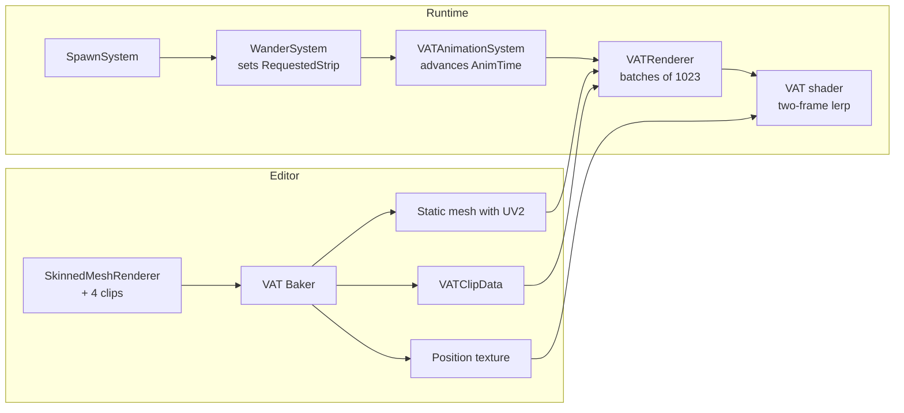

# VAT Crowd

Render thousands of animated characters in Unity by baking skinned-mesh animations into **Vertex Animation Textures (VATs)** and driving them with **Entities (ECS)** and GPU instancing in URP.

- **Editor baker** (`Tools → VAT → Baker`) turns a `SkinnedMeshRenderer` plus four animation clips into a position texture, a static mesh and a clip-layout asset.
- **One-click crowd setup** (`Tools → VAT → Create Crowd Setup`) builds the material, character prefab, SubScene, spawner and renderer from a bake.
- **VAT shader** (`Custom/VAT`) moves each vertex on the GPU, blending between neighbouring frames so playback is smooth.
- **ECS runtime**: spawning, a simple wandering AI, per-entity animation playback, and a renderer that draws up to 1,023 characters per draw call.
- **Multiple character types**: each baked character gets its own renderer; entities are matched to renderers by their clip data, with no IDs to keep in sync.

No bones are evaluated on the CPU at runtime, which is what lets the crowd scale.

---

## Requirements

| | Version |
|---|---|
| Unity | 6000.6 or newer |
| Universal Render Pipeline | 17.6.0 (installed automatically) |
| Entities | 6.6.0 (installed automatically, with Burst, Collections and Mathematics) |

Your project must already be using URP.

## Installation

**From Git (recommended).** In Unity open *Window → Package Manager → + → Add package from git URL…* and enter:

```
https://github.com/AimEnShoot/com.aimeebelke.vat-crowd.git#v0.2.0
```

Pinning a tag (`#v0.2.0`) keeps projects on a known version; drop it to track the default branch.

**Or edit `Packages/manifest.json`:**

```json
"com.aimeebelke.vat-crowd": "https://github.com/AimEnShoot/com.aimeebelke.vat-crowd.git#v0.2.0"
```

**Local development.** Clone the repo into a project's `Packages/` folder to use it as an embedded (editable) package, or use *Add package from disk…* and pick `package.json`.

---

## How it works

A VAT is a float texture used as a data container:

- **Each column is one vertex**, so texture width = vertex count.
- **Each row is one frame**, so texture height = total frames of all clips.
- **Each pixel's RGB is that vertex's XYZ position** for that frame.

The baker writes a `UV2` coordinate on every vertex pointing at its column. At runtime the shader reads two neighbouring rows for the current time and interpolates between them. All four clips (Idle, Walk, Run, Attack) live in one texture as consecutive "strips" of rows; `VATClipData` records where each strip starts and how long it is.



### Runtime pieces

| Type | Kind | Role |
|---|---|---|
| `VATCharacterAuthoring` | Authoring | Put on any character prefab. Bakes `VATAnimation` and `VATCharacter` (which clip data this entity uses). |
| `AgentAuthoring` | Authoring | Movement speeds, wander radius and health. Bakes `NPCFollow` and `Health`. |
| `SpawnerAuthoring` | Authoring | Spawns *count* copies of a prefab in a disc of *radius*. |
| `VATAnimation` | Component | `AnimTime`, `AnimStrip`, `RequestedStrip`, `ClipDurations`. |
| `VATCharacter` | Shared component | Reference to the character's `VATClipData`; groups entities per character. |
| `NPCFollow` | Component | Wander state, target, home position, speeds, random seed. |
| `Health`, `Dead` | Component, tag | `Dead` entities are skipped by AI, animation and rendering. |
| `SpawnSystem` | System | Instantiates spawner prefabs once, randomising position, facing and animation phase. |
| `WanderSystem` | System | Picks Idle/Walk/Run/Attack on timers, moves agents, writes `RequestedStrip`. |
| `VATAnimationSystem` | System | Switches to the requested strip and advances playback for every character type. |
| `VATRenderer` | MonoBehaviour | Reads ECS data each frame and draws matching entities with `Graphics.RenderMeshInstanced`. |
| `VATDebugRenderer` | MonoBehaviour | Plays one baked character with no ECS, for checking a bake. |

---

## Setting up a crowd in a new project

### 1. Pick a mesh

- It must be a **single `SkinnedMeshRenderer`**. Characters split into several skinned meshes (head, torso, arms…) need merging first, or use a combined LOD mesh.
- **16,384 vertices maximum**, the largest texture width Unity supports. Lower is better: memory scales with vertices × frames. A low-poly crowd mesh of 1,000–3,000 vertices is ideal.
- The root needs an `Animator` with an Avatar if your clips are humanoid.

### 2. Pick four clips

Bake them in this order, which matches `AIState` and the baker window:

| Slot | Index | Notes |
|---|---|---|
| Idle | 0 | Looping. |
| Walk | 1 | Use the **in-place** version where available. |
| Run | 2 | In-place. |
| Attack | 3 | Plays on a loop while the agent stays in the Attack state. |

Humanoid clips retarget onto any humanoid rig. The baker cancels horizontal root drift, but in-place clips give the cleanest result.

### 3. Bake

1. Drag the character model into any open scene (the baker samples it there and restores its pose afterwards).
2. Open **Tools → VAT → Baker**.
3. Set **Source SMR** to the model's `SkinnedMeshRenderer`, and assign the four clips.
4. **FPS**: 24 is a good default. Higher means smoother but taller textures.
5. **Save Path**: where the outputs go, e.g. `Assets/VAT/`.
6. **Asset Prefix**: a unique name per character, e.g. `Soldier`. Rebaking with the same prefix overwrites the assets **in place**, so every material, prefab and renderer that references them keeps working.
7. **Correct SMR Rotation**: turn on if the character comes out lying on its back or facing the wrong way. 3ds Max / Z-up FBX exports often need this.
8. Click **Bake VAT**, then remove the model from the scene.

Outputs (for prefix `Soldier`):

- `Soldier_VAT_Positions.asset`: the position texture
- `SoldierVAT_Mesh.asset`: static mesh with UV2
- `Soldier_VATClipData.asset`: strip layout

### 4. Create the crowd setup (quick way)

Steps 5–7 below can be done for you:

- After a bake, click **Set Up Crowd For This Bake →** in the baker window, or
- open **Tools → VAT → Create Crowd Setup**, or
- right-click the `…_VATClipData` asset → **VAT → Create Crowd Setup**.

Pick the clip data, check the fields, and click **Create Crowd Setup**. The tool:

| Piece | Behaviour |
|---|---|
| VAT mesh | Found next to the clip data by the baker's naming (`<Prefix>VAT_Mesh`). |
| Material | Reuses a `Custom/VAT` material already using this bake; otherwise creates `<Prefix>_VAT.mat` (assign an albedo in the window). Always makes sure GPU instancing is on. |
| Character prefab | Reuses a prefab whose `VATCharacterAuthoring` points at this clip data; otherwise creates `<Prefix>_Character.prefab` with `VATCharacterAuthoring` + `AgentAuthoring`. |
| VAT Renderer | Updates the active scene's renderer for this clip data, or adds one. |
| Spawner | Added to an existing SubScene you pick, or to a new `<Scene>_<Prefix>_SubScene`. The scene must be saved first; you'll be prompted. |
| Camera, light, ground | Optional; each is only added if the scene doesn't have one. |

Running it again for the same bake reuses everything instead of duplicating it. To add a second character type, run it with that character's clip data and choose the existing SubScene.

**Right-click → VAT → Quick Crowd Setup (Defaults)** skips the window: 2,000 characters, radius 40, new SubScene.

Save the scene and press **Play**. The rest of this section is what the tool does, if you'd rather set it up by hand.

### 5. Create the material

1. Create a material and set its shader to **Custom/VAT**.
2. Assign the character's albedo texture to **Albedo Texture**, and optionally a **Colour Tint**.
3. **Tick *Enable GPU Instancing*.** This is required, because the renderers draw with instancing.

You don't need to fill in *Position Texture* or *Texture Height*: the renderers set both from the clip data every frame.

### 6. Check the bake (optional)

Create an empty GameObject, add **VAT Debug Renderer**, assign the mesh, material and clip data, and press Play. Use **Anim Strip** to switch clips. If it looks wrong here, fix the bake before moving on.

### 7. Build the ECS scene

1. **Character prefab.** Create an empty GameObject and add:
   - **VAT Character Authoring**: set *Clip Data* to the character's `VATClipData`.
   - **Agent Authoring**: speeds, turn speed, wander radius, health.

   Save it as a prefab. It needs no mesh renderer; drawing is done by `VATRenderer`.
2. **SubScene.** In your scene, *right-click the Hierarchy → New Sub Scene → Empty Scene*.
3. **Spawner.** Inside the SubScene, create an empty GameObject, add **Spawner Authoring**, assign the prefab and set *Count*, *Radius* and *Seed*. Its position is the centre of the crowd.
4. **Renderer.** In the *main* scene (not the SubScene), create an empty GameObject, add **VAT Renderer**, and assign the same mesh, material and clip data.
5. Add a camera, light and ground, and press **Play**.

The crowd exists only in Play mode: entities are spawned at runtime, so the Scene view is empty in Edit mode.

### Adding another character type

Bake the new character with its own prefix, then run **Create Crowd Setup** for its clip data (choosing your existing SubScene), or repeat steps 5–7 by hand: a second material, prefab, `VATRenderer` and `Spawner`. Each renderer draws only the entities whose `VATCharacterAuthoring` uses the same clip data.

---

## Extending it

- **Your own AI.** `WanderSystem` is just one way to drive agents. Any system can set `VATAnimation.RequestedStrip` to pick a clip; schedule it before `VATAnimationSystem`.
- **Removing characters.** Add the `Dead` tag to stop an entity animating and being drawn.
- **Tuning.** Change crowd size on `SpawnerAuthoring.count`; speeds and wander radius on `AgentAuthoring`.

## Troubleshooting

| Symptom | Fix |
|---|---|
| Nothing appears in Edit mode | Expected: spawning happens at runtime. Press Play. |
| Nothing appears in Play mode | Check the `VATRenderer`'s clip data is the **same asset** as the prefab's `VATCharacterAuthoring`. Check the spawner is inside the SubScene and the renderer is outside it. |
| Error about the material needing instancing | Tick **Enable GPU Instancing** on the material. |
| Character lies on its back or faces sideways | Rebake with **Correct SMR Rotation** on. |
| Character slides or drifts while walking | Use in-place clips, and match `walkSpeed`/`runSpeed` to the clip's stride. |
| Animation looks like a flip-book | Raise the bake FPS. The shader already interpolates between frames, but very low FPS shows. |
| Bake fails or texture is huge | The mesh has too many vertices. Use a lower LOD (16,384 is the hard limit). |
| Play mode is frozen on frame 1 | The Unity editor doesn't update Play mode while it's in the background on macOS. Click into Unity. |

## Limitations

- **Four clips per character.** Clip durations are stored in a `float4`, and the baker window has four slots.
- **Hard cuts between clips.** There's no blending when an agent changes state.
- **Faceted lighting.** Normals are rebuilt in the pixel shader from screen-space derivatives, so surfaces look flat-shaded rather than smooth.
- **Rendering runs on the main thread** in `VATRenderer` (`LateUpdate`), copying entity data into instancing buffers each frame.

---

## Credits

The VAT baking approach, baker structure, debug renderer and shader are based on code shared by **Corrie Green** in the Unity livestream *"How to Use Vertex Animation Textures with ECS in Unity"* (Unity YouTube channel, July 2026). The ECS runtime, package structure and later changes were built on top of that.

## License

MIT. See [LICENSE.md](LICENSE.md).
